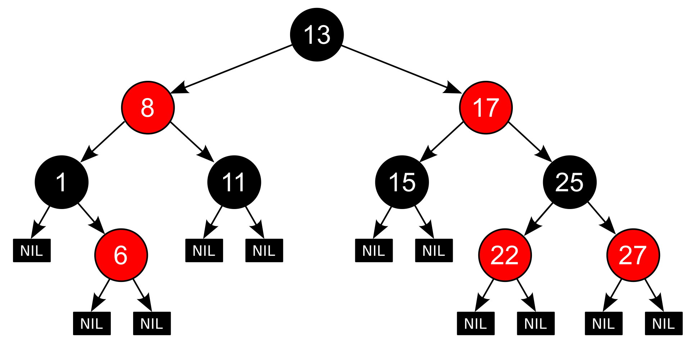

# CPP_containers

Implementation of the s21_containers.h library.

## Information

This library implements the basic standard C++ container classes: `vector`. `deque`, `list`, `map`, `queue`, `set`, `stack`, `vector`, `array` and `multiset`.
Implementations provide a full set of standard methods and attributes for element handling, container capacity checking and iteration. As a bonus, you can also implement several other container classes from the C++ container library that are not as commonly used, but differ in their implementation details.

## About implementation

- The program must is developed in C++ language of C++17 standard using gcc compiler
- Code style - Google style for C++ https://google.github.io/styleguide/cppguide.html
- There is full coverage of expression calculation modules with unit-tests using the GTest library
- The logic of the Standard Template Library (STL) is followed (in terms of checks, memory handling and behaviour in abnormal situations)
- The classes were completed with the appropriate methods, according to the table:

| Modifiers      | Definition                                      | Containers |
|----------------|-------------------------------------------------| -------------------------------------------|
| `iterator insert_many(const_iterator pos, Args&&... args)`          | inserts new elements into the container directly before `pos`  | List, Vector |
| `void insert_many_back(Args&&... args)`          | appends new elements to the end of the container  | List, Vector, Queue |
| `void insert_many_front(Args&&... args)`          | appends new elements to the top of the container  | List, Stack |
| `vector<std::pair<iterator,bool>> insert_many(Args&&... args)`          | inserts new elements into the container  | Map, Set, Multiset |